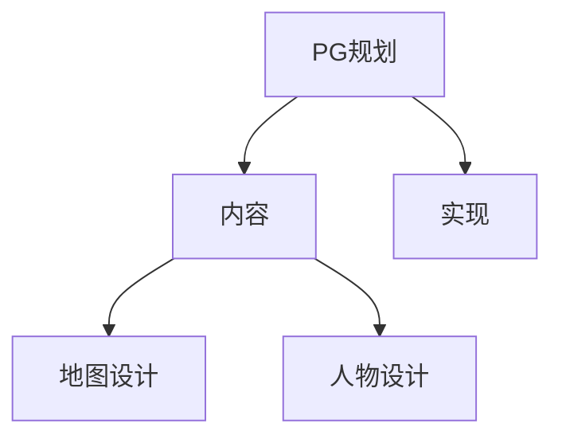
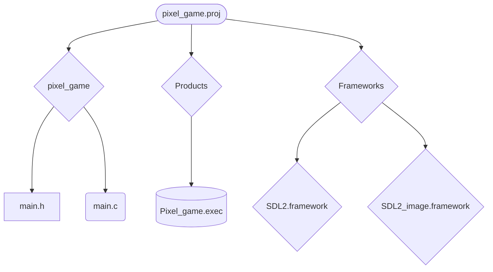

# blog

日期 yyyy,mm,dd

## PG规划

### 当前PG标题模式

### PG规划变化

## 工程变化

### 目录图

### 目录变化

### type 定义变化

### 变量变化

### 函数变化

## 实现计划

- [ ] main
- Map

  - renderMap

    - [x] 创建等待渲染的地图
    - [ ] 待渲染地图的加载器
    - [x] 释放地图 
    - [ ] 等待加载地图的加载线程
    - [ ] 地图渲染器

  - tile

    - [x] 创建tile
    - [x] 初始化tile

    - 读tile库
      - [ ] 读tile信息文件
      - [ ] 读tile图片库
- load
  - loadSaves
    - [ ] 读取所有地图信息，并渲染，载入信息、事件等
  - loadConfiguration
    - [ ] 「等待计划中」
- init
  - [ ] 「等待计划中」

## 展望明天
