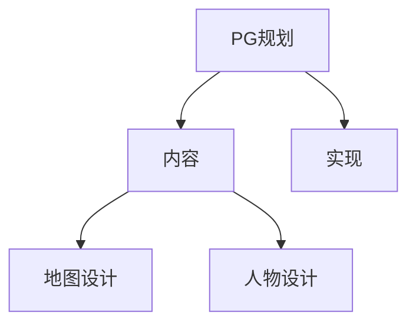
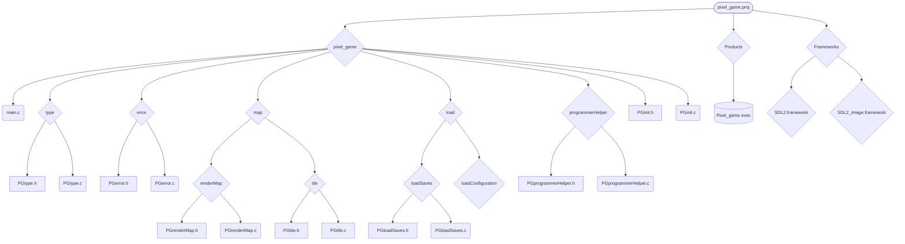

# blog

日期 2022,01,28

## PG规划

### 当前PG标题模式




### PG规划变化

#### 实现新增

```markdown
游戏中，存囊系统本质上就是一个个的，最大长度确定的数组。在这些数组中的每个空间中，如果是物体开始的位置，则存储物品的编号，不然则存储物品开始的位置。取物品到手上的动作，实际上是找到物品头为位置，然后到头位置获取物品的编号，然后将编号存入“手”的变量里，最后再将从物品头位置开始的所有都替换成“空”。
```

实现中，「游戏储存文件」下的「文件变量」增加`上次结束时「PGstorgeBasic.c」中 ‘BasicID’`


## 工程变化


### 目录图



### 目录变化

- 在程序目录「pixel_game」下添加「programmerHelper」目录，并在其下存入 「PGprogrammerHelper.h」 和 「programmerHelper.c」 两个文件。

### type 定义变化

在「PGtype.h」中， `PGsavesFilePlayerImformation.ID` 以及 `PGsavesFileOwnerImformation.ID` 均从 `char ID[20]` 改为 ` char ID[21]`。这样的调整是为了在ID字符串的末尾增加`'\0'`以指示结束。

同样在「PGtype.h」中，新添

```c
typedef union{
    int mainPosition;
    int number;
} PGstorgeItemValue;

typedef struct{
    int8_t valueType;
    PGstorgeItemValue val;
} PGstorgeItem;

typedef struct{
    uint32_t type;
    uint64_t ID;
    unsigned int height;
    unsigned int width;
    PGstorgeItem* storgeBag;
} PGstorgeBag;
```

三个type用来记录存囊系统里存储的物品。

同时在`PGfilevariable`中添加`uint64 storgeBasicID`用来在每次创建了一个storge后为其赋值。

在新建立的「programmerHelper」目录里的「PGprogrammerHelper.h」中写下了

```c
#define PAN(X) if(X == NULL){PGsetError("pointer X doesn't point to anything");return -1;}
```

用来减少书写困难。

### 变量变化

无

### 函数变化

在「PGprogrammerHelper.h」中声明了一个为占用物理空间不同的变量组赋值的函数。写这个函数的原因是在读取文件的时候，常常会读到变量类型不同的，空间上却是连续的量。如下

```c
int PGmemoryAlocateToDifferentSizeOfVariable(void* memory,uint32_t memoryLength,int* typeList,uint32_t typeListLength,...);
```

实现在「PGprogrammerHelper.c」中，如下

```c
int PGmemoryAlocateToDifferentSizeOfVariable(void* memory,uint32_t memoryLength,int* typeList,uint32_t typeListLength,...){
    //这个变量用来记录使用过的memory用了多少byte
    int byteMemoryLengthAtNow = 0;
    //这三个变量用来转化memory的类型
    uint8_t* u8pointer = memory;
    //可选参数变量的定义
    va_list argptr;
    va_start(argptr, typeListLength);
    for(int i = 0;i < typeListLength;i++){
        if(memoryLength > byteMemoryLengthAtNow){
            if(typeList[i] == 8){
                *(va_arg(argptr, int8_t*)) = u8pointer[byteMemoryLengthAtNow];
                byteMemoryLengthAtNow++;
            }
            if(typeList[i] == 32){
                *(va_arg(argptr, int32_t*)) = ((uint32_t)u8pointer[byteMemoryLengthAtNow] << 24) + ((uint32_t)u8pointer[byteMemoryLengthAtNow + 1] << 16) + ((uint32_t)u8pointer[byteMemoryLengthAtNow + 2] << 8) + (uint32_t)u8pointer[byteMemoryLengthAtNow + 3];
                byteMemoryLengthAtNow += 4;
            }
            if(typeList[i] == 64){
                *(va_arg(argptr, int64_t*)) = ((uint64_t)u8pointer[byteMemoryLengthAtNow] << 56) + ((uint64_t)u8pointer[byteMemoryLengthAtNow + 1] << 48) + ((uint64_t)u8pointer[byteMemoryLengthAtNow + 2] << 40) + ((uint64_t)u8pointer[byteMemoryLengthAtNow + 3] << 32) + ((uint64_t)u8pointer[byteMemoryLengthAtNow + 4] << 24) + ((uint64_t)u8pointer[byteMemoryLengthAtNow + 5] << 16) + ((uint64_t)u8pointer[byteMemoryLengthAtNow + 6] << 8) + ((uint64_t)u8pointer[byteMemoryLengthAtNow + 7]);
                byteMemoryLengthAtNow += 8;
            }
        }
        else{
            PGsetError("PGmemoryAlocateToDifferentSizeOfVariable:No enough space for the variables.\0");
            return -1;
        }
    }
    return 0;
}
```

在「PGloadSavse.c」中， `int PGloadSaves(char* filePath,PGloadSaveFile* var)` 函数的末尾添加了如下代码

```c
   //读取房主信息
    char ownerID[21];
    //读取房主信息.读取房主ID
    fread(ownerID, sizeof(char), 20, fp);
    ownerID[21] = '\0';
    for(int i = 0;i < 20;i++){
        var->owner.ID[i] = ownerID[i];
    }
    //读取房主上次上次游戏和游戏版本时间信息
    uint32_t fileOwner[2];
    fread(fileOwner,sizeof(fileOwner),1,fp);
    var->owner.lastPlayTime = fileOwner[1];
    var->owner.lastPlayVersion = fileOwner[2];
```

这段代码只是用来读取部分房主信息的

读取文件变量部分和文件头部分改为

```c
uint32_t fileHeader[6];
    fread(fileHeader, sizeof(uint32_t), 1, fp);
    int typeListOfFileHeader[5] = {32,32,64,32,32};
    PGmemoryAlocateToDifferentSizeOfVariable(fileHeader, sizeof(fileHeader), typeListOfFileHeader, 5,&(var->header.mapHeight),&(var->header.mapWidth),&(var->header.seed),&(var->header.whenCreat),&(var->header.versionWhenCreat));
    //读取文件变量
    uint8_t fileVariable[26];
    fread(fileVariable,sizeof(fileVariable),1,fp);
    int typeListOfFileVariable[6] = {8,64,32,64,8,32};
    PGmemoryAlocateToDifferentSizeOfVariable(fileVariable, sizeof(fileVariable), typeListOfFileVariable, 6,&(var->var.diffculty),&(var->var.gameDuration),&(var->var.newestVersion),&(var->var.storgeBasicID),&(var->var.numberOfWorld),&(var->var.numberOfRegisteredID));
```

这样更改有两个目的，一是文件变量中新增了一个需要读取的信息，所以在文件变量读取部分加上这个；二是因为现在使用的方式可以保证百分百不会出问题。现在这个函数的总体变为了

```c
int PGloadSaves(char* filePath,PGloadSaveFile* var){
    //打开文件
    FILE* fp = NULL;
    fp = fopen(filePath, "rb");
    if(fp == NULL){
        PGsetError(strcat("Can not open the file.", strcat(filePath, ".\0")));
        return -1;
    }
    //识别文件
    char sign[7] = "";
    fread(sign, sizeof(sign), 1, fp);
    sign[6] = '\0';
    if(strcmp(sign, "PGsave\0") != 0){
        PGsetError(strcat("Expected PGsave file, but not", strcat(filePath, ".\0")));
        return -1;
    }
    //读取文件
    //读取文件头
    uint32_t fileHeader[6];
    fread(fileHeader, sizeof(uint32_t), 1, fp);
    int typeListOfFileHeader[5] = {32,32,64,32,32};
    PGmemoryAlocateToDifferentSizeOfVariable(fileHeader, sizeof(fileHeader), typeListOfFileHeader, 5,&(var->header.mapHeight),&(var->header.mapWidth),&(var->header.seed),&(var->header.whenCreat),&(var->header.versionWhenCreat));
    //读取文件变量
    uint8_t fileVariable[26];
    fread(fileVariable,sizeof(fileVariable),1,fp);
    int typeListOfFileVariable[6] = {8,64,32,64,8,32};
    PGmemoryAlocateToDifferentSizeOfVariable(fileVariable, sizeof(fileVariable), typeListOfFileVariable, 6,&(var->var.diffculty),&(var->var.gameDuration),&(var->var.newestVersion),&(var->var.storgeBasicID),&(var->var.numberOfWorld),&(var->var.numberOfRegisteredID));
    //读取房主信息
    //读取房主信息.读取房主ID
    char ownerID[21];
    fread(ownerID, sizeof(char), 20, fp);
    ownerID[20] = '\0';
    for(int i = 0;i < 20;i++){
        var->owner.ID[i] = ownerID[i];
    }
    //读取房主上次上次游戏和游戏版本时间信息
    uint32_t fileOwner[2];
    fread(fileOwner,sizeof(fileOwner),1,fp);
    var->owner.lastPlayTime = fileOwner[0];
    var->owner.lastPlayVersion = fileOwner[1];
    return 0;
}

```

很可惜的是，因为背包等系统尚未完成，这个也还是没有完成。


而在新添加的 「PGstorgeBasic.h」 中完成了以下四个声明

```c
PGstorgeBag PGcreatStorgeBag(unsigned int height,unsigned int width,uint32_t type);
int PGputItemToStorge(PGstorgeBag aBag,unsigned int x,unsigned int y,unsigned int item);
unsigned int PGgetItemFromStorge(PGstorgeBag aBag,unsigned int x,unsigned int y);
int PGstorgeBasicUpdateBasicID(PGloadSaveFile* file)；
```

并在「PGstorgeBasic.c」中完成了部分实现

```c
static uint64_t BasicID = 0;
PGstorgeBag PGcreatStorgeBag(unsigned int height,unsigned int width,uint32_t type){
    PGstorgeItem* mem = (PGstorgeItem*)malloc(sizeof(PGstorgeItem) * length * width);
    memset(mem, 0, width * length);
    PGstorgeBag res = {
        type;
        BasicID;
        height;
        width;
        mem;
    }
    BasicID += 1;
    return res;
}
int PGputItemToStorge(PGstorgeBag aBag,unsigned int x,unsigned int y,unsigned int item){
    PAN(aBag);
    //还没有写item，所以空着
    return 0;
}
unsigned int PGgetItemFromStorge(PGstorgeBag aBag,unsigned int x,unsigned int y){
    PAN(aBag);
    if(y < aBag.height && x < aBag.width){
        return aBag.storgeBag[aBag.width * y + x];
    }
    else{
        PGsetError("PGgetItemFromStorge:Asked beyond the scope.\0");
        return -1;
    }
}
int PGstorgeBasicUpdateBasicID(PGloadSaveFile* file){
    BasicID = file->var.storgeBasicID;
    return 0;
}
```

这分别是创建背包，存储、取出物品。但是因为物品没有完成，所以这个也没办法完成。

## 实现计划

- [ ] main
- Map

  - renderMap

    - [x] 创建等待渲染的地图
    - [ ] 待渲染地图的加载器
    - [x] 释放地图 
    - [ ] 等待加载地图的加载线程
    - [ ] 地图渲染器

  - tile

    - [x] 创建tile
    - [x] 初始化tile

    - 读tile库
      - [ ] 读tile信息文件
      - [ ] 读tile图片库
- load
  - loadSaves
    - [x] 读取地图文件头
    - [x] 读取地图文件变量
    - [ ] 其他信息
  - loadConfiguration
    - [ ] 「等待计划中」
- init
  - [ ] 「等待计划中」
- storgeBag
  - [x] 创建背包
  - [ ] 存放物品 「正在等待完成物品变量」
  - [x] 拾取物品

## 明日展望

适量完成和物品相关的变量的设计
