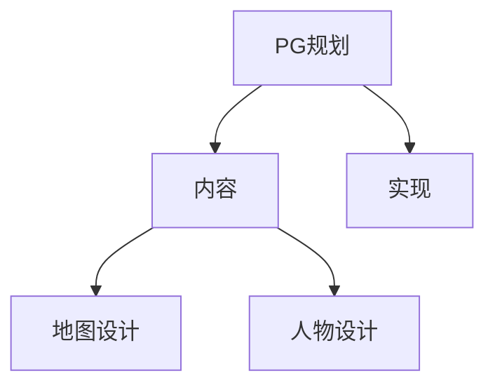
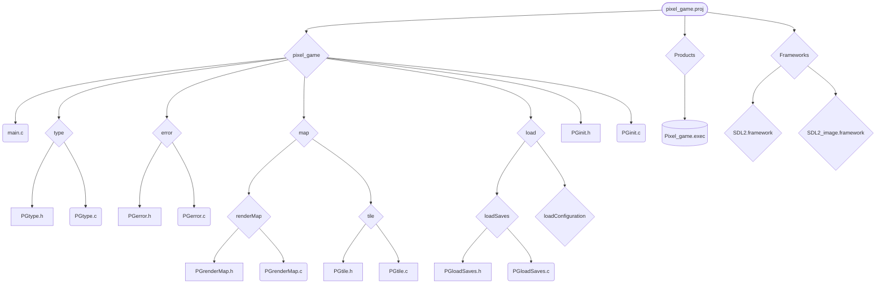

# blog

日期 2022,01,28

## PG规划

### 当前PG标题模式




### PG规划变化

#### **「实现」中，关于tile绘图的更变为**

```markdown

用Tile实现地图，Tile只是用来绘图的，并没有其他功能。每种Tile有一个编号，当需要交互的时候，通过编号查找Tile交互对应的事件。大地图存储在硬盘里，主角移动到下一个渲染范围(一般都是窗口大小)时，由内存里的一个小地图(数组)先将主角周围三个窗口大小内的地图摘取下来备用渲染，有一个线程专门做这件事。绘图的时候，渲染所有可见的tile和UI。每个Tile都有一个和相邻的Tile不一样的编号，用以区分周围的Tile(默认是 1 ～ 9)，如下。

|  1   |  2   |  3   |  1   |  2   |  3   |  1   |  2   |  3   |
| :--: | :--: | :--: | :--: | :--: | :--: | :--: | :--: | :--: |
|  4   |  5   |  6   |  4   |  5   |  6   |  4   |  5   |  6   |
|  7   |  8   |  9   |  7   |  8   |  9   |  7   |  8   |  9   |
|  1   |  2   |  3   |  1   |  2   |  3   |  1   |  2   |  3   |
|  4   |  5   |  6   |  4   |  5   |  6   |  4   |  5   |  6   |
|  7   |  8   |  9   |  7   |  8   |  9   |  7   |  8   |  9   |
|  1   |  2   |  3   |  1   |  2   |  3   |  1   |  2   |  3   |
|  4   |  5   |  6   |  4   |  5   |  6   |  4   |  5   |  6   |
|  7   |  8   |  9   |  7   |  8   |  9   |  7   |  8   |  9   |
```

#### 在「实现」中添加游戏「游戏存储文件」和「游戏配置文件」的信息如下

```markdown
- 游戏存储文件：

  - 文件头(不变信息)：标记 PGsave，地图高(uint32_t)，地图宽(uint32_t)，地图种子号(uint64_t)，创建时间精确到秒(uint32_t)，创建版本(uint32_t)
  - 文件变量：游戏难度(uint8_t)，进行时长单位秒(uint64_t)，最新运行版本(uint32_t)，世界数量(uint8_t)，包括房主的登入玩家数量(uint32_t)

  - 世界一 tile 序列：每个tile用一个 uint32_t 大小储存 sign ，依次排开。

  - 世界二 tile 序列

  - ……

  - 世界n tile 序列

  - 玩家信息：

    - 房主：id(固定长度字符串，字数未定)，上次登录时间(uint32_t)，上次登录版本(uint32_t)，玩家身体状态信息，上次退出时周围单位如怪物等(未定列表)，[boss激活状态(uint32_t)]

    - 客户玩家一：id(固定长度字符串，字数未定)，上次登录时间(uint32_t)，上次登录版本(uint32_t)，玩家身体状态信息
	- 额外附加信息
- 游戏配置文件：
  - 文件头(不变信息)：标记 PGconfiguration
  - 文件变量：游戏版本(uint32_t)，窗口高(uint32_t)，窗口宽(uint32_t)，游戏渲染大小(uint8_t)，全屏游戏否(bool:uint8_t)，游戏本体地址长度(uint32_t)，游戏tile库地址长度(uint32_t)，游戏脚本库地址(uint32_t)
  - 游戏本体地址：char类型的串
  - 游戏tile库地址
  - 游戏脚本库地址
```

## 工程变化

### 目录图



### 目录变化

无

### type 定义变化

- 「PGtype.h」中的改变，`PGUninitTile`和`PGInitTile`两个结构体中，中新增`int sign`，用来作为每种 tile 的标志，每种 tile 的 sign 是不同的，这样就可以仅凭数字区分这些 tile 了。而这个变量的赋值是在 `PGcreatTile()` 中完成的，这个之后再说。

- 同样是「PGtype.h」中的改变，新增了`#define PGrenderMap PGtile*`宏作为「 renderMap」目录中，一些文件中的，一些函数的返回值和变量。renderMap 中新增的文件之后再说。

- 依然是「PGtype.h」，新增了

  ```c
  typedef struct{
      uint32_t mapHeight;
      uint32_t mapWidth;
      uint64_t seed;
      uint32_t whenCreat;
      uint32_t versionWhenCreat;
  } PGsaveFileheader;
  
  typedef struct{
      uint8_t diffculty;
      uint64_t gameDuration;
      uint32_t newestVersion;
      uint8_t numberOfWorld;
      uint32_t numberOfRegisteredID;
  } PGsaveFileVariable;
  
  typedef struct{
      char ID[20];
      uint32_t thirsty;
      /*
      uint32_t strenth;
      uint32_t thirsty;
      ...
       */
      uint32_t lastPlayTime;
      uint32_t lastPlayVersion;
  } PGsavesFilePlayerImformation;
  
  typedef struct{
      char ID[20];
      uint32_t thirsty;
      /*
      uint32_t strenth;
      uint32_t thirsty;
      bool BossI;
      bool BossII;
      ...
       */
      uint32_t lastPlayTime;
      uint32_t lastPlayVersion;
  } PGsavesFileOwnerImformation;
  
  typedef struct{
      PGsaveFileheader header;
      PGsaveFileVariable var;
      PGsavesFileOwnerImformation owner;
  } PGloadSaveFile;
  ```

  五个类，用来加載保存的地圖中的信息。而其中关于玩家的两个类尚未完工。加载具体方式见函数部分。

### 变量变化

- 在「PGtile.c」文件中，新增`static uint32_t tileSign = 0`来为`PGUninitTile`和`PGInitTile`两个结构体中的`int sign`赋值，这个变量每运行一次`PGcreatTile()` 就加 1。

### 函数变化

- 在「PGtile.c」文件中

  ```c
  PGtile PGcreatTile(char* path,int x,int y,int w,int h,bool collision,int collideW,int collideH,bool interactive,int interactiveType){
      PGtile result;
      result.uninitTile.path = path;
      result.uninitTile.w = w;
      result.uninitTile.h = h;
      result.uninitTile.x = x;
      result.uninitTile.y = y;
      result.uninitTile.collision = collision;
      result.uninitTile.collideH = collideH;
      result.uninitTile.collideW = collideW;
      result.uninitTile.interactive = interactive;
      result.uninitTile.interactiveType = interactiveType;
      return result;
  }
  ```

  变为了

  ```c
  PGtile PGcreatTile(char* path,int x,int y,int w,int h,bool collision,int collideW,int collideH,bool interactive,int interactiveType){
      PGtile result;
      result.uninitTile.path = path;
      result.uninitTile.w = w;
      result.uninitTile.h = h;
      result.uninitTile.x = x;
      result.uninitTile.y = y;
      result.uninitTile.collision = collision;
      result.uninitTile.collideH = collideH;
      result.uninitTile.collideW = collideW;
      result.uninitTile.interactive = interactive;
      result.uninitTile.interactiveType = interactiveType;
      result.uninitTile.sign = tileSign;
      tileSign += 1;
      return result;
  }
  ```

  在 13～14 行添加了为 sign 赋值的行为，并且让 tileSign 加一。

- 「PGrenderMap.h」中新添了三个函数

  ```c
  #include <stdio.h>
  #include "PGtype.h"
  #include "PGtile.h"
  #include "PGerror.h"
  PGrenderMap PGcreatRenderMap(uint32_t height,uint32_t length);
  int PGloadRenderMap(char* filePath,unsigned int starH,unsigned int starL,unsigned int endH,unsigned int endL);
  int PGfreeRenderMap(PGrenderMap aMap);
  ```

- 「PGrenderMap.c」中分别定义了上述三个函数

  ```c
  #include "PGrenderMap.h"
  #include <stdlib.h>
  PGrenderMap PGcreatRenderMap(uint32_t height,uint32_t length){
      PGtile* result = (PGtile*)malloc(sizeof(PGtile) * height * length);
      memset(result, 0, sizeof(PGtile) * height * length);
      return result;
  }
  
  int PGloadRenderMap(char* filePath,unsigned int starH,unsigned int starL,unsigned int endH,unsigned int endL){
      
      return 0;
  }
  
  int PGfreeRenderMap(PGrenderMap aMap){
      if(aMap == NULL){
          PGsetError("There is no memory in the Map.");
          return -1;
      }
      free(aMap);
      return 0;
  }
  ```

  其中`PGloadRenderMap`尚未完成，而另外两个函数的功能分别是分配空间和释放内存。

- 在「PGloadSaves.h」中声明了这个函数，用来加载游戏

  ```c
  int PGloadSaves(char* filePath,PGloadSaveFile* var);
  ```

- 而在「PGloadSaves.c」中为这个函数部分完成了定义

  ```c
  int PGloadSaves(char* filePath,PGloadSaveFile* var){
      //打开文件
      FILE fp = NULL;
      fp = fopen(filePath, "rb");
      if(fp == NULL){
          PGsetError(strcat("Can not open the file.", strcat(filePath, ".\0")));
          return -1;
      }
      //识别文件
      char sign[7] = "";
      fread(sign, sizeof(sign), 1, fp);
      sign[6] = '\0';
      if(strcmp(sign, "PGsave\0") != 0){
          PGsetError(strcat("Expected PGsave file, but not", strcat(filePath, ".\0")));
          return -1;
      }
      //读取文件
      //读取文件头
      uint32_t fileHeader[6];
      fread(fileHeader, sizeof(uint32_t), 1, fp);
      var->header.mapHeight = fileHeader[0];
      var->header.mapWidth = fileHeader[1];
      var->header.seed = ((uint64_t)fileHeader[2] << 32) + fileHeader[3];
      var->header.whenCreat = fileHeader[4];
      var->header.versionWhenCreat = fileHeader[5];
      //读取文件变量
      uint8_t fileVariable[18];
      fread(fileVariable,sizeof(fileVariable),1,fp);
      var->var.diffculty = fileVariable[0];
      var->var.gameDuration = ((uint64_t)fileVariable[1] << 56) + ((uint64_t)fileVariable[2] << 48) + ((uint64_t)fileVariable[3] << 40) + ((uint64_t)fileVariable[4] << 32) + ((uint64_t)fileVariable[5] << 24) + ((uint64_t)fileVariable[6] << 16) + ((uint64_t)fileVariable[7] << 8) + fileVariable[8];
      var->var.newestVersion = ((uint32_t)fileVariable[9] << 24) + ((uint32_t)fileVariable[10] << 16) + ((uint32_t)fileVariable[11] << 8) + fileVariable[12];
      var->var.numberOfWorld = fileVariable[13];
      var->var.numberOfRegisteredID = ((uint32_t)fileVariable[14] << 24) + ((uint32_t)fileVariable[15] << 16) + ((uint32_t)fileVariable[16] << 8) + fileVariable[17];
      //读取房主信息
      return 0;
  }
  ```

  其餘部分之後再補。

## 实现计划

- [ ] main
- Map

  - renderMap

    - [x] 创建等待渲染的地图
    - [ ] 待渲染地图的加载器
    - [x] 释放地图 
    - [ ] 等待加载地图的加载线程
    - [ ] 地图渲染器

  - tile

    - [x] 创建tile
    - [x] 初始化tile

    - 读tile库
      - [ ] 读tile信息文件
      - [ ] 读tile图片库
- load
  - loadSaves
    - [ ] 读取所有地图信息，并渲染，载入信息、事件等
  - loadConfiguration
    - [ ] 「等待计划中」
- init
  - [ ] 「等待计划中」

## 明日展望

將文件上傳到 github 然後完成部分讀取房主信息。